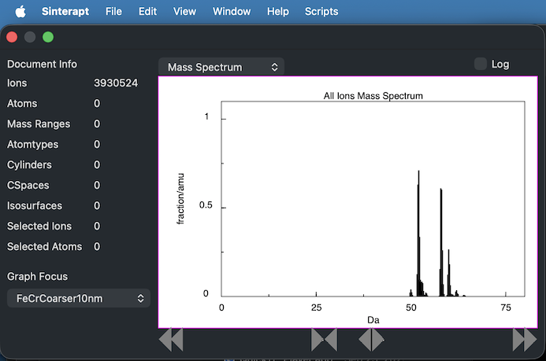
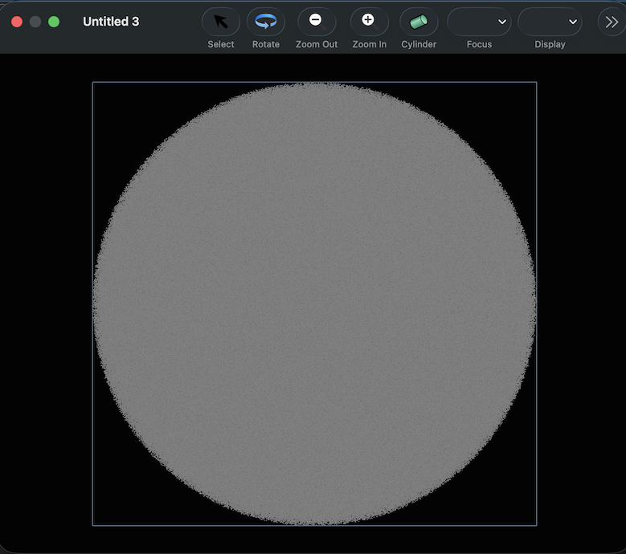

# SinteraptSupportFiles
freely available support files for Sinterapt, the Atom Probe Tomography data analysis app.

Sinterapt gets its name because it is an app with a Scripting INTERface for analysis of APT data.  There's some familiar UI as well, but much of the value of the app lives in its scriptability.

The contents of this repo are some sample data files in the data directory, and some sample scripts in the scripts directory.  Here's a short tour of some of the features of the app:

##Opening a File

After launching the app, Choose "Open" from the file menu and choose a file in the .pos format.  Alternatively, it is possible to double-click on a .pos file in the Finder -- it will open in Sinterapt if there are no other applications registered for .pos files.  The app only supports .pos files for now, but support for more formats is on the future feature list.

When the file opens, two windows will appear, an inspector window which gives an overview of the objects identified in the file, and a graphics window which displays an ion/atom map.

## The Inspector Window

The inspector window looks like this:



The left side of the window shows an overview of the various objects identified in this document.  After opening a .pos file, there are no mass ranges or other geometrical objects defined, so only the ion count is something other than zero.

The right side of the window can display a number of graphs or images, depending on the current "focus". When a .pos file is opened, the focus is the collection of ions in the file, and a mass spectrum is displayed.

The buttons under the mass spectrum adjust the visible range of the mass spectrum.

## The Graphics Window

The graphics window looks like this:



Because there are no mass ranges defined or atomtypes defined, all the ions are displayed in gray.  All of the individual ions are displayed as single-pixel dots.

After clicking on the "rotate" button, clicking and dragging in the window will allow rotation on the ionmap.  Clicking the "Zoom In" and "Zoom Out" buttons will adjust the magnification.  

After a bit of manipulation, the window may look like this:


## Using the Scripting Interface

Currently, definition of mass ranges is best done via the scripting interface.  Application of .rrng files is a feature I'm working on, but for now, scripting is the best way to accomplish this.

Before diving in to mass ranges, familiarize yourself with using the scripting interface:

First locate and open the ScriptEditor application.  It is usually located in the the Utilities folder of the Applications Folder:


If you open the Script Editor application, you should be able to create an empty script window, like this:


Let's write a very simple script.  Type the following in the script editor window:

```
tell app "Sinterapt"
    count documents
end 
```

after typing this, click the "compile" button in the toolbar of the script editor window.  It's the one that looks like a hammer, highlighted here in red:


After clicking the button, if all has gone well, you'll notice a few things changed:

1. The text formatting has changed.
2. The word "app" in the first line changed to "application"
3. The last line changed from "end" to "end tell"


Now it is time to run the script.

Tap the run button in the toolbar.  That's the triangle next to the "Compile" button. When the script runs, it communicates with the "Sinterapt" application and asks it how many documents it currently has open.  "Sinterapt" responds and the result is displayed in the bottom half of the Script Editor window.  If you've been following along and have already opened a .pos file, the answer should be 1, or more if you've opened more than 1.


If you haven't yet opened a .pos file, open one now, so that the script returns "1".  

Now lets try getting some information from the document.  try the following scripts:

```
tell app "Sinterapt"
    get name of document 1
end 
```

```
tell app "Sinterapt"
    count ions of document 1
end 
```

```
tell app "Sinterapt"
    get {mass, coordinates} of ion 7 of document 1
end 
```

If you successfully get the data you were expecting as results from these scripts, you are ready to define mass ranges

## Defining Mass Ranges

The FeCrSpinodal sample file provided with this repo is the output of a Spinodal decomposition simulation.  It only requires 2 mass ranges. Here's a script that defines them:

```
tell application "Sinterapt"
    tell document 1
        make new mass range with properties {lower bound:49, upper bound:55, atom list:{"Cr"}, name:"Cr+"}
        make new mass range with properties {lower bound:57, upper bound:65, atom list:{"Fe"}, name:"Fe+"}
    end tell
end tell
```
 
After running this script, you'll notice a few things happend.

The inspector window now tells us that there are two Mass Ranges and two atomtypes in the document.

The graphics window now displays different colors for the different ions.
 
The "result" of the script shown in the bottom of the Script Editor window will be something like 

```
mass range id 28 of document id 15 of application "Sinterapt"
```   

the script consisted of two lines, and the result shown only shows the result from the last command.  Because the command was "make new mass range ...", the result of that command is a reference to the mass range that was created.

You may notice, that even though there was no explicit command to make an atomtype, two atomtypes were created.  This is because each mass range implicitly contained a reference to an atomtype in its "atom list" property.  When a corresponding atom type cannot be found, it is created automatically

