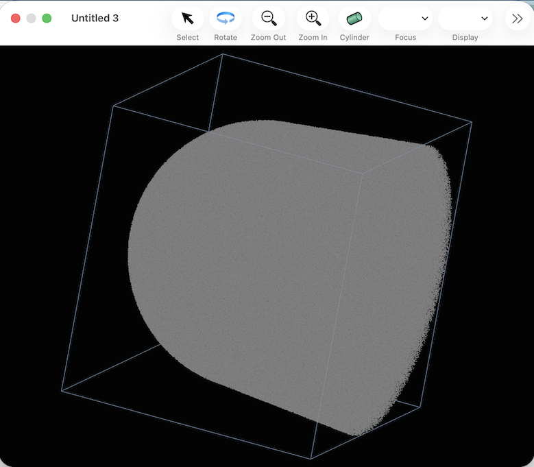

#### Previous topic: [Opening a File](docs/OpeningAFile.md)    Next Topic:  [Using the Scripting Interface](TheScriptingInterface.md)

## 3D Visualization

Because there are no mass ranges defined or atomtypes defined, If no mass ranges are defined, all the ions in the dataset will be displayed in gray.  All of the individual ions are displayed as single-pixel dots.

The 3D view of the dataset can be manipulated in a number of ways:

## Magnification:

Clicking the "Zoom In" and "Zoom Out" buttons will adjust the magnification in steps.

Alternatively, a mouse with a scroll wheel or capable of scroll-wheel-ish touch gestures will zoom in or out in response to a scroll wheel gesture.

## Rotation:

After clicking on the "rotate" button, clicking and dragging in the window will allow rotation on the ionmap. 

Alternatively, a mouse with a scroll wheel or capable of scroll-wheel-ish touch gestures will rotate in response to a scroll wheel gesture with the shift and control keys held down

## Translation:

A mouse with a scroll wheel or capable of scroll-wheel-ish touch gestures will pan up/down and left/right in response to a scroll wheel gesture with the shift key held down

After a bit of manipulation, the window may look like this:

#### Previous topic: [Opening a File](docs/OpeningAFile.md)    Next Topic: [Using the Scripting Interface](TheScriptingInterface.md)