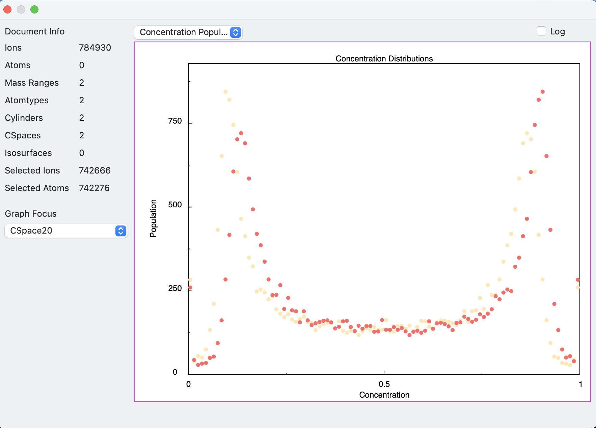

#### previous topic: [Planes and Planar Maps](Planes.md)  next topic: [Isosurfaces and Proxigrams](Isosurfaces.md)

## Concentration Space

A Concentration space is a three dimensional grid overlaid on the sample volume from which we can calculate the concentrations of all the atoms in the sample for each three dimensional point within the grid.

Generally, the concentration space is most useful when it extends over the entire sample volume (though this is not required).  

When an isosurface is created, it uses a reference concentration space to calculate the surface.  Thus, how the concentration space is defined affects the shape of the isosurface.

The properties required for defining a concentration space are as follows:

- cell length:  This is the grid spacing.  It is a floating point value.  The grid is cubic, so the dimension is the same in all three dimensions.  Additionally, the x, y, and z axes of the grid are the same as the sample's x, y, and z axes.  

- dimensions:  This is a three dimensional integer vector, which describes how big the gris is in each dimension.  For example, if this value is {10,10,20}, there are 2000 grid points and twice as many grid points in the z direction as in x and y.

- offset: This is the location of the grid point corresponding to grid coordinates {0,0,0}.  Usually, this value is close tot he corner of the box with the least x, least y and least z values.

- delocalization distance: This value determines the distance that each ion's contribution to the grid is delocalized.  When mapping ions to grid points, a "splat" transfer function is used, resulting in a intrinsic delocalization of (0.5 * binsize) in each dimension, for an effective delocalization of sqrt(3) * 0.5 * binsize.  If this value is larger than (0.5 * binsize), an additional gaussian delocalization is applied, so as to result in a total effective delocalization of this value.  This value is very useful in the case that one wants to create a concentration space with a finer grid, but also wants to avoid increasing the statistical error due to a smaller sampling volume.  In this case, two concentration spaces with different binsizes but with the same delocalization distance should differ only in the mesh size, not in sampling statistics.

Here is a script which creates a concentration space that covers the entire sample volume:

```
set delocalization to 15
set celllength to 20

tell application "Sinterapt"
	set boxProps to properties of box of document 1
	
	set dimsx to 1 + ((x span of boxProps) div celllength)
	set dimsy to 1 + ((y span of boxProps) div celllength)
	set dimsz to 1 + ((z span of boxProps) div celllength)
	set dims to {dimsx, dimsy, dimsz}
	set offx to (minimum x of boxProps) - (celllength * 0.5)
	set offy to (minimum y of boxProps) - (celllength * 0.5)
	set offz to (minimum z of boxProps) - (celllength * 0.5)
	set offsetVec to {offx, offy, offz}
	
	tell document 1
		set cs to make new concentration space with properties {name:"CSpace20", cell length:celllength, dimensions:dims, offset:offsetVec, delocalization distance:delocalization}
	end tell
end tell
```
 
The script figures out the dimensions and the offset of the concentration space by querying the document for its "box" -- the cuboid that contains all the ions, and using its size and minimim coordinates to figurure out the needed values based on a target grid spacing.

After creating a concentration space, you'll notice that the concentration space now has an entry in the "graph focus" popup in the inspector window.  Selecting it reveals a graph of "Concentration Populations"".  That is, a relative count of grid points that have a given concentration of each atomtype 



		

#### previous topic: [Planes and Planar Maps](Planes.md)  next topic: [Isosurfaces and Proxigrams](Isosurfaces.md)
