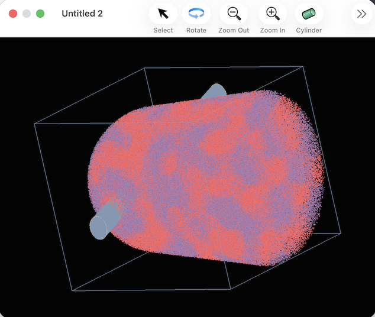
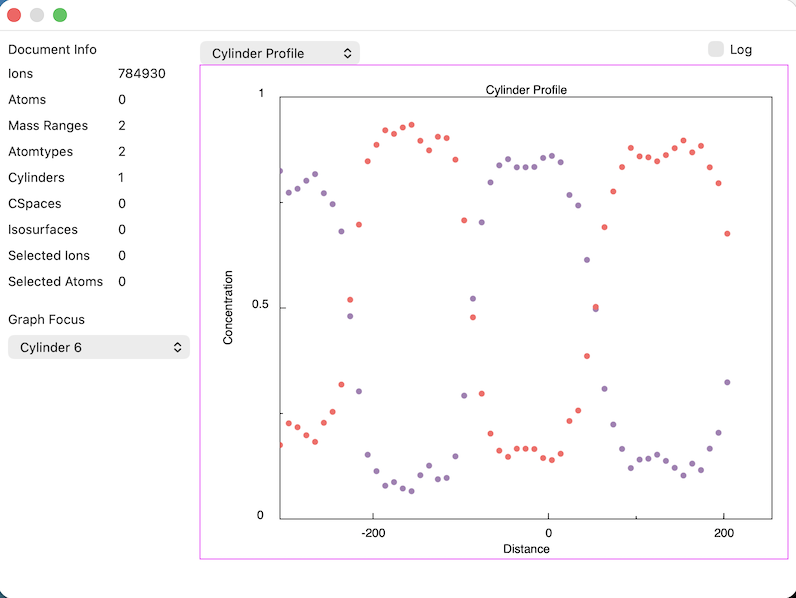
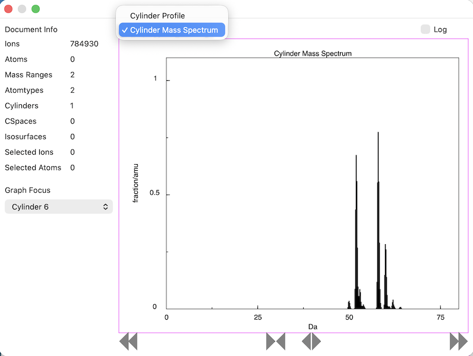

#### previous topic: [Atomtypes](dAtomtypes.md)  next topic: [Planes and Planar Maps](Planes.md)

## Cylinders

Sinterapt can work with a number of geometrical objects, and the simplest of these is the cylinder.

Geometrically, a cylinder is defined by a point in space, a direction parallel to the cylinder, and a radius.

To define a cylinder in Sinterapt, click on the Cylinder button in the graphics window toolbar.  Then, click and drag in the graphics window:  The point of the click will define a point on the cylinder, the direction of the current view defines the direction of the cylinder, and the distance dragged before letting the mouse up defines the radius.

After the drag is complete, the cylinder should be highlighted in the graphics window, as shown here:

It may be hard to see, because the view is looking down the cylinder, parallel to its sides.  To get a better view, tap the rotate button and rotate the view a little bit to get a better view, like this:

You'll notice some effects from making the cylinder:

- In the Inspector window, the "Cylinders" field should no longer be zero.
- In the Inspector window, the "Graph Focus" popup should now have a entry for the cylinder -- i.e. it is now possible to change the focus to be the cylinder

To view a concentration profile along the axis of the cylinder, including only the atoms within the cylinder itself, click the "Graph Focus" popup button and choose the cylinder you just made.  It should appear automatically:

It is also possible to view just a mass spectrum for ions within the bounds of the cylinder.  To do this, select "Cylinder Mass Spectrum" from the popup above the graph:

To put the data for any on the graphs on the system clipboard, click on the graph (in the future, this will change to a contextual menu). The data can then be pasted in another app, for example, Excel:

#### previous topic: [Atomtypes](dAtomtypes.md)  next topic: [Planes and Planar Maps](Planes.md)
