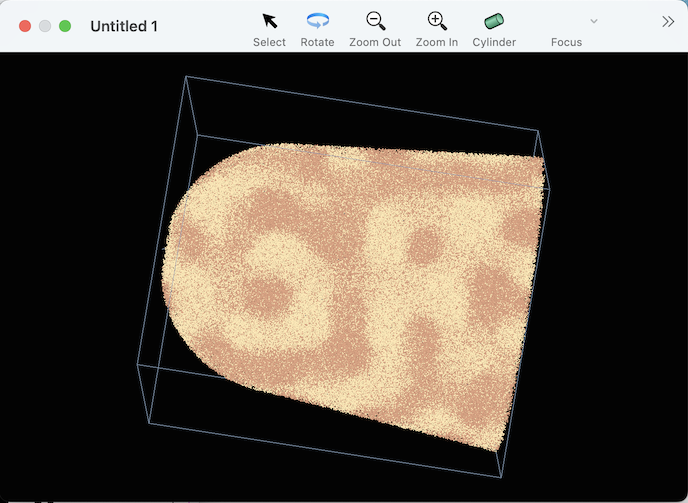

#### previous topic: [Using the Scripting Interface](TheScriptingInterface.md)  next topic: [Atomtypes](Atomtypes.md)


## Defining Mass Ranges

The FeCrSpinodal sample file provided with this repo is the output of a Spinodal decomposition simulation.  It only requires 2 mass ranges. Here's a script that defines them:

```
tell application "Sinterapt"
    tell document 1
        make new mass range with properties {lower bound:49, upper bound:55, atom list:{"Cr"}, name:"Cr+"}
        make new mass range with properties {lower bound:57, upper bound:65, atom list:{"Fe"}, name:"Fe+"}
    end tell
end tell
```
 
After running this script, you'll notice a few things happend.

The inspector window now tells us that there are two Mass Ranges and two Atomtypes in the document.

The graphics window now displays different colors for the different atoms.  It should look something like:



Note that the Sinterapt graphics window displays atoms, not ions. This is a distinction without a difference in the case that each ion corresponds to a single atom, but in the case where some ions are multiatomic, the graphics window displays the atoms separately.

The "result" of the script shown in the bottom of the Script Editor window will be something like 

```
mass range id 28 of document id 15 of application "Sinterapt"
```   

the script consisted of two lines, each of which was a different command. The result shown only shows the result from the last command.  Because the command was "make new mass range ...", the result of that command is a reference to the mass range that was created. 

You may notice, that even though there was no explicit command to make an atomtype, two atomtypes were created.  This is because each mass range implicitly contained a reference to an atomtype in its "atom list" property.  When a corresponding atom type cannot be found, it is created automatically

## RRNG files

Support for applying RRNG files is in the pipeline.  In the meantime, running scripts is the only way to define mass ranges.  However, the script can be made a bit less awkward by condensing the importasnt information into a list, and then iterating through.  Here;'s an exaple:

```
set massRangeDataList to {¬
	{13.454, 13.778, "Al"}, ¬
	{26.897, 27.561, "Al"}, ¬
	{27.847, 28.796, "Fe"}, ¬
	{53.802, 54.286, "Fe"}, ¬
	{55.761, 57.501, "Fe"}, ¬
	{29.382, 29.884, "Co"}, ¬
	{58.822, 59.593, "Co"}, ¬
	{28.904, 29.243, "Ni"}, ¬
	{29.93, 30.038, "Ni"}, ¬
	{30.432, 30.548, "Ni"}, ¬
	{30.918, 31.103, "Ni"}, ¬
	{31.914, 32.076, "Ni"}, ¬
	{57.787, 58.646, "Ni"}, ¬
	{59.813, 62.587, "Ni"}, ¬
	{63.82, 64.238, "Ni"}, ¬
	{25.932, 26.067, "Cr"}, ¬
	{51.887, 52.086, "Cr"}}


repeat with mrd in massRangeDataList
	set ll to item 1 of mrd
	set ul to item 2 of mrd
	set atomname to item 3 of mrd
	tell application "Sinterapt"
		tell document 1
			make new mass range with properties {lower bound:ll, upper bound:ul, atom list:{atomname}}
		end tell
	end tell
end repeat
```

In this script, note the use of the  ¬  character, which is used in AppleScript to continue the line around a line break, which makes working with lists a little easier.

#### previous topic: [Using the Scripting Interface](TheScriptingInterface.md)  next topic: [Atomtypes](Atomtypes.md)
