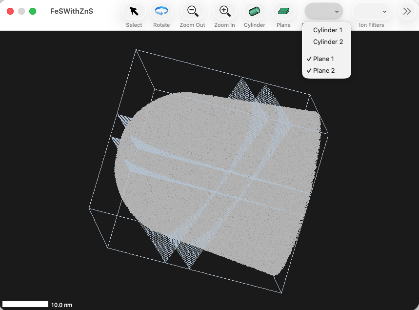
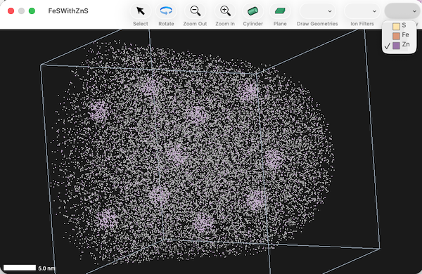

#### previous topic: [Subsets](docs/Subsets.md)   next topic: [Exporting Movies](Movies.md)

## Graphics Controls

### Display of geometrical objects

Cylinders, Planes and Surfaces can be shown or hidden via the Draw Geometries toolbar menu

### Filters for Display of ions in the ion map

The Ion Filters toolbar menu allows control over which ions/atoms are displayed.  There are two standard items in the menu: "Typed Only" and "Selection Only" 

Selecting "Typed Only" restricts the display to atoms defined by the mass ranges.  Ions which are untyped are not shown.

Selecting "Selection Only" restricts the display to the selection.  

In addition to these two standard entries in the menu, every geometrical item that can define a set of ions, or a "region of interest", appears here as well.  For exampl, a cylinder defines all the ions within the cylinder.  Selecting it here applies that set of ions to the filter.

If multiple filters are selected, the filter is applied as the intersection between sets of ions indicated by each filter.  There is a scriptable setting "ion filter combination strategey" which can switch between intersection and union logic.

This image shows a sample where the only ions shown are those within both the cylinder and inside the planar slice:

Atom Display Menu

Lastly, the Atom Display toolbar menu allows control over which types of atoms are displayed.  

This image shows the state of a sampel where only the minority species is shown, thus allowing visualization of clusters of that species:

#### previous topic: [Subsets](docs/Subsets.md) next topic: [Exporting Movies](Movies.md)
