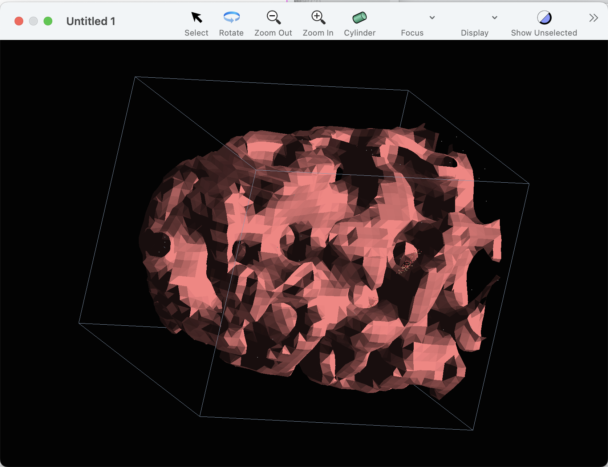
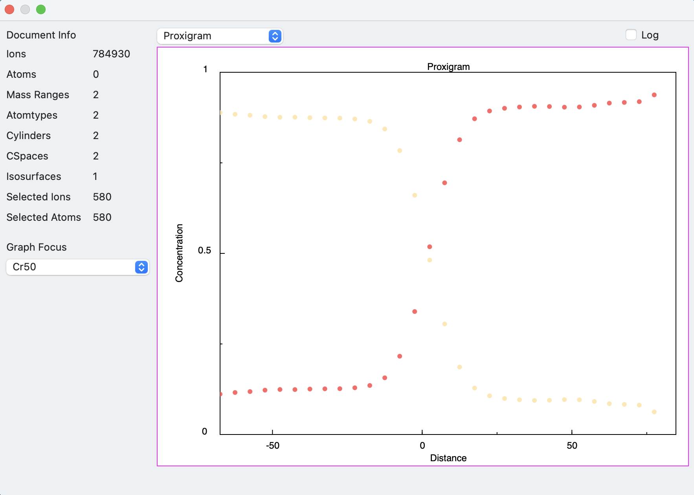

#### previous topic: [ConcentrationSpaces](ConcentrationSpaces.md)   next topic: [Exporting Movies](Movies.md)

## Isosurface

Each isosurface is defined with respect to a concentration space. So, when creating an isosurface, you'll first need to create a concentration space to use as a reference.

The other parameters needed are:

name:  An optional parameter, but very useful as the name is displayed in other parts of the UI

- atomnames:  This is a list of strings of element names, indicating which components are to be evaluated for the concentration.  Typically, the list contains one value.  For example, if the intention is to generate an isosurface for 50% Fe, the value of this parameter would be {"Fe"} . 

If there are more than one item in the list, for example {"Ga", "In"}, this indicates that the  threshold should be applied to the sum of the concentrations of Ga and In.

- threshold: This is the concentration value used as the threshold for the isosurface.   

- confidence:  This is a value indicating how confident (according to standard statistical error)  the measurement at the gridpoint needs to be to qualify.  This value is expressed in a statistical sigma value. Positive values express higher confidence.  A value of zero means no statistical evaluation is performed.

This parameter is useful for suppressing noise at the edges of a sample, where the populations of the gridpoints are low.

- concentration space:  This parameter is supplied as a reference. See [Scripting In Depth C: References](UsingReferences.md) for details.

Here's a script which creates an isosurface, assuming that the given concentration space has already been created:

```
tell application "Sinterapt"
	if exists concentration space "CSpace20" of document 1 then
		
		set theCSpace to concentration space "CSpace20" of document 1
		make new isosurface in document 1 with properties {name:"Cr50", confidence:1.0, threshold:0.5, atomnames:{"Cr"}, concentration space:theCSpace}
	else
		display dialog "there is no concentration space named \"CSpace20\""
	end if
end tell
```

When the isosurface has been created, you'll notice the following:

- The isosurface now appears as an item in the "Focus" dropdown of the graphics window.  If selected, the surface shows in the graphics window:



- The isosurface also appears as an item in the "Graph Focus" popup button in the inspector window.  Choosing it will kick off the calculation of a proxigram.
Note:  Calculation of a proxigram takes a lot of time.  Be patient.  I'm working on how to improve this experience.  After the calculation is finished, it will show in the inspector window:




#### previous topic: [ConcentrationSpaces](ConcentrationSpaces.md) next topic: [Exporting Movies](Movies.md)
