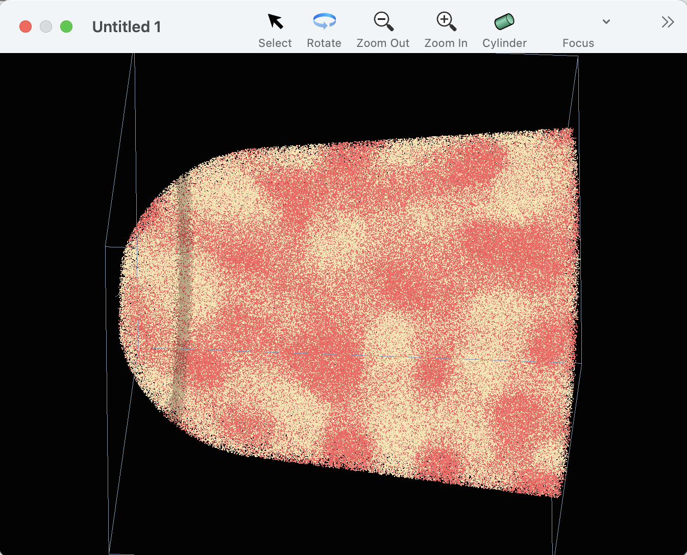
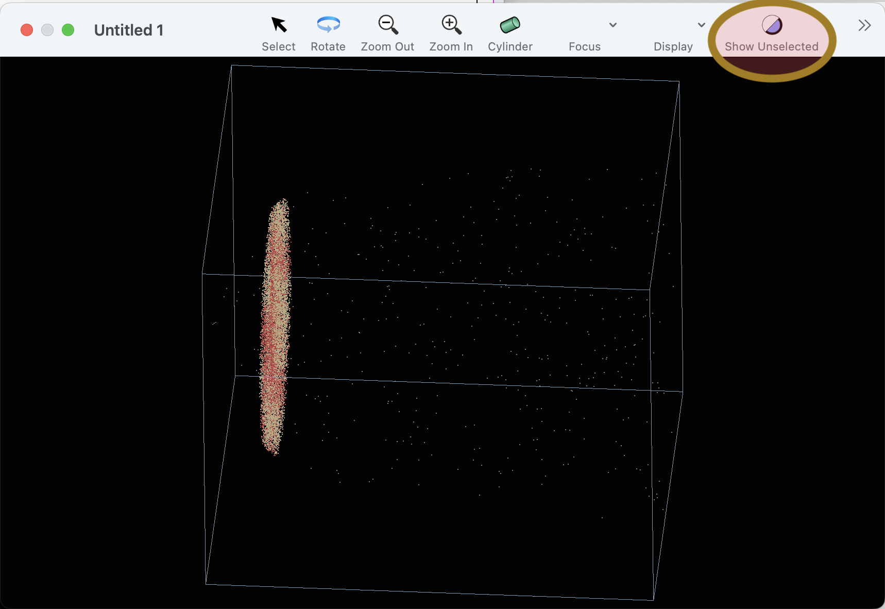

#### previous topic: [Cylinders and Concentration Profiles](Cylinders.md)

## Planes

A plane is another geometrical object that can be used to specify a range of interest in a dataset.

Geometrically, a Sinterapt plane is defined by a point on the plane, a vector perpendicular to the plane.  In addition, a thickness is useful for selecting a volume of interest near the plane.

Future versions will have a UI for making a plane.  For now, use the scripting interface to make a plane:

```
tell application "Sinterapt"
	set thePosition to {0, 0, 100}
	set theNormal to {0, 0, 1}
	set theThickness to 20
	tell document 1
		make new plane with properties {name:"Plane t10", position:thePosition, normal:theNormal, thickness:theThickness}
	end tell
end tell   
```

Now, the is a plane, but Sinterapt doesn't yet have a good way to show the plane (this feature is coming).  However, the plane can be used as a way to set the selection of the document (each ion has a "selected" property).  Use the following script to set the selection to all the ions in the bounds of the plane that you just made:

```
tell application "Sinterapt"
	tell document 1
		set the selection to plane "Plane t10"
	end tell
end tell
```

The ions in the plane should now be highlighted in the graphics window:



To see only the ions that are part of the selection, toggle the "Show Unselected Ions" button in the toolbar, highlighted here:




#### next topic: [ConcentrationSpaces](ConcentrationSpaces.md)
