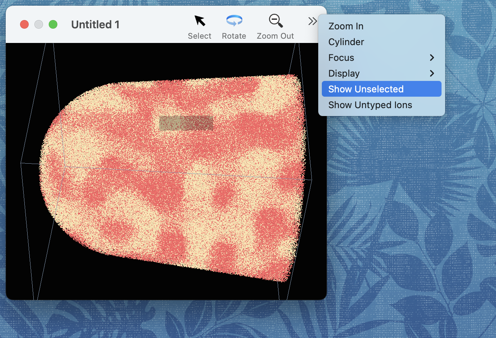

#### previous topic: [Atomtypes](Atomtypes.md)  next topic: [Cylinders and Concentration Profiles](Cylinders.md)

## The selection

Users can select a set of ions as one way of defining a range of interest.  For example, instead of looking at a mass spectrum for the whole sample, one can look at a mass spectrum for only the range of interest.

A simple way to select some of the ions in the sample is to drag out a selection rectangle.  Tap the "Select" button in the toolbar, and then click and drag out a rectangle.  The ions within the rectangle will be highlighted -- they are now the "selection".

When a selection is defined, the Inspector window will display how many ions and atoms are selected, and a "Selected Ions Mass Spectrum" will be available if the "graph focus" is set to the document.

It is possible to view only the selected atoms -- to do this, toggle the "Show Unselected" button in the toolbar of the graphics window (if your graphics window is too narrow, this button may be in the "overflow menu:")

The behavior of dragging a selection rectangle can be changed by holding down the shift or control keys when the drag finishes.

If the shift key is down, the ions inside the rectangle will be added to the current selection -- essentially a union operation on the selected set.

If the command key is down, the ions outside of the selection rectangle will be unselected -- essentially an intersection operation on the selected set.

If the shift and command keys are down, the ions inside the rectangle will be unselected -- essentially a subtraction operation on the selected set.

Known issue:  The geometry of the selection rectangle is currently not lined up correctly with the view angle.

#### previous topic: [Atomtypes](Atomtypes.md)  next topic: [Cylinders and Concentration Profiles](Cylinders.md)
